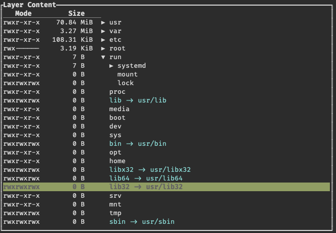

# TUI Tree Widget

Widget built to show Tree Data structures with an optional added table.

This crate was forked from (tui-rs-tree-widget)[https://github.com/EdJoPaTo/tui-rs-tree-widget] in order to add
the table functionality, which is not upstreamed due to the overall low quality of my changes.

It is discouraged to use this crate.

